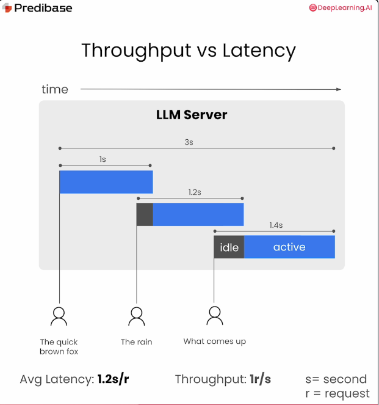

## Overview
This directory goes over some techniques on how to serve LLMs efficiently along with my notebooks from [1]:
- KV cache to improve latency
- Latency vs Throughput in LLM inference
- Batching to improve throughput
- Continuous batching to improve throughput & latency

## Some details:
- Transformer LM:
    -     
- `KV cache` to improve latency
    - Transformer decoders have `q, k, v` (query, keys, values) which are used to calculate attention. 
    - For new token generation, latency increases since all the previous tokens need to be considered & their computations are re-done.
    - Certain computations on `k, v` (keys, values) can be re-used & cached to improve latency for next token.
    - This leads to 2 phases: 
        - Prefill (for 1st token, no caching).
        - Decode (For remaining tokens, with caching).
        -       
- `Latency vs Throughput ` 
    $$AverageLatency = \frac{TotalTime}{MaxTokens}$$
    $$Throughput = \frac{BatchSize * MaxTokens}{TotalTime}$$
    - Note that $BatchSize$ is not considerded in latency.
- `Batching` to improve throughput
    - Batch multiple sequences together into single inference.
    - Pads sequences with `padding token` to make them same size.
    - Improves throughput. But may also impact latency at large batch sizes
    -      
- `Continuous batching` to improve throughput & latency
    - Runs batching & after each token generation, continuously:
        - Adds new sequences into existing batches.
        - Remove sequences that are done & swap in new requests
    - Note: 
        - Prefill & Decode steps are handled as separate batches to optimize for latency.
    -   
    -   

- `Some huggingface commands/output attributes`:
    - inputs = tokenizer(batch_prompts, padding=True, return_tensors="pt")
    - outputs.logits, outputs.past_key_values.
    - next_tokens = tokenizer.batch_decode(next_token_ids)

## References:
1. https://learn.deeplearning.ai/courses/efficiently-serving-llms
