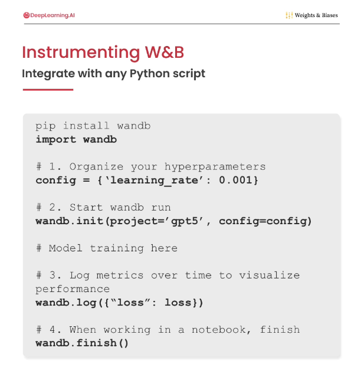
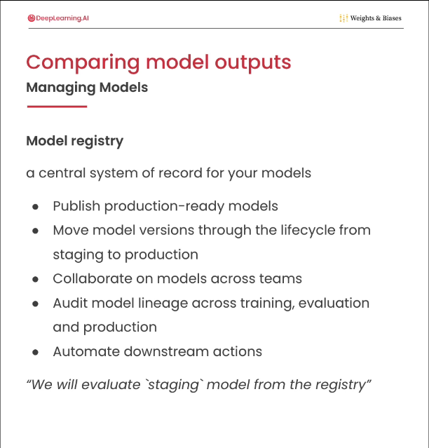
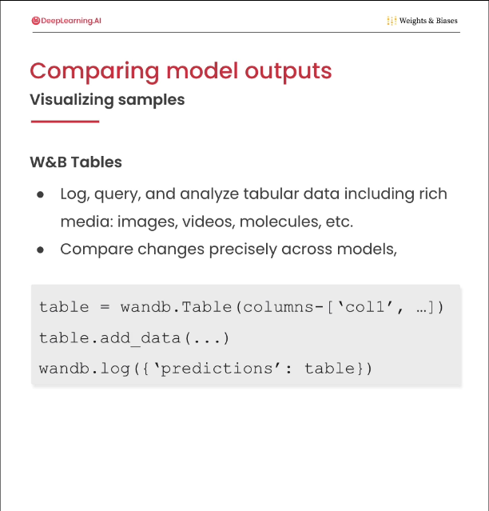
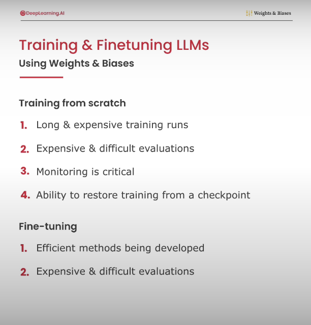
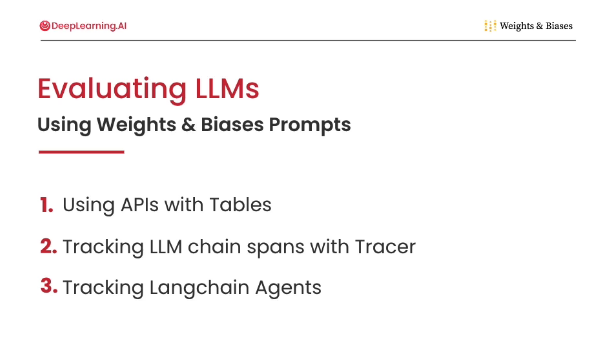
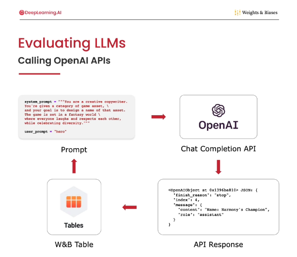
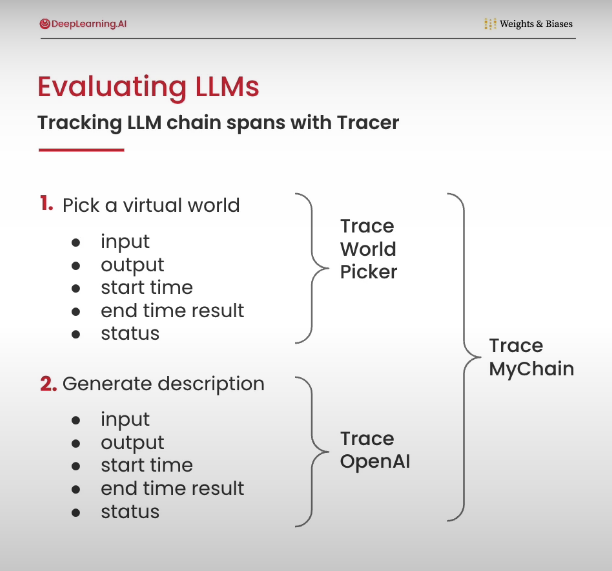
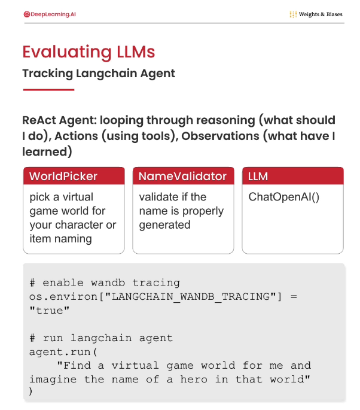

## Overview
- This directory goes over how to instrument model training / evaluation with `Weights & Biases` (`W&B` or `wandb`) to help monitoring/visualization & speed-up debug. 
- Its based on https://learn.deeplearning.ai/courses/evaluating-debugging-generative-ai

## Training Workflow:
- Modify training code. Add hooks to:
    - Initiate `wandb` with appropriate project name & training configs. 
    - Log key metrics (train/val loss, val outputs/images, etc.)
    - Save deisred checkpoints & add them into Artifacts
    - Log the artifacts
- Run training experiments with different configs.
- Use W&B UI to track progress, view metrics, debug, etc.
- Select the desired artifact from the metrics
- Link it to the model registry (a central system to record/share models)

## Evaluation:
- Download the desired artifact
- Get the config and updated
- Use W&B `Tables` to visualize results
    - Text comparison (LLM prompt/output, etc.)
    - Image comparison (Diffusion DDPM/DDIM images, etc.)
- For LLM evaluation:
    - Can use wandb `Tables`
    - Can use wandb`Trace` or Tracing features for more complex chains.

## Images:
- Instrument W&B
    -    
- Model registry
    -    
- Table
    -    
- LLM Train/Finetune monitoring
    -    
- LLM Eval
    -    
    -    
    -    
    -    

## References:
- https://learn.deeplearning.ai/courses/evaluating-debugging-generative-ai/
- https://learn.deeplearning.ai/courses/diffusion-models/