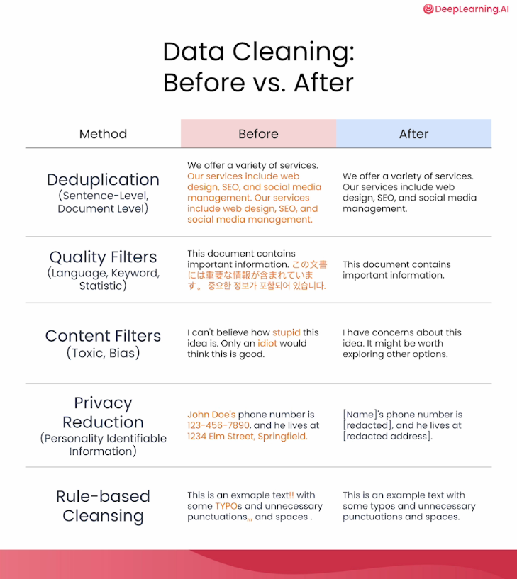
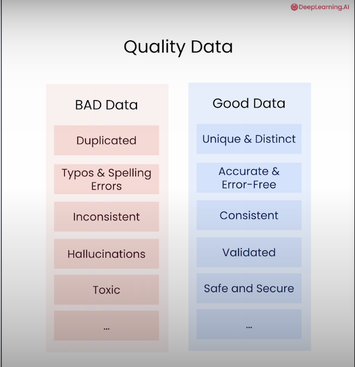
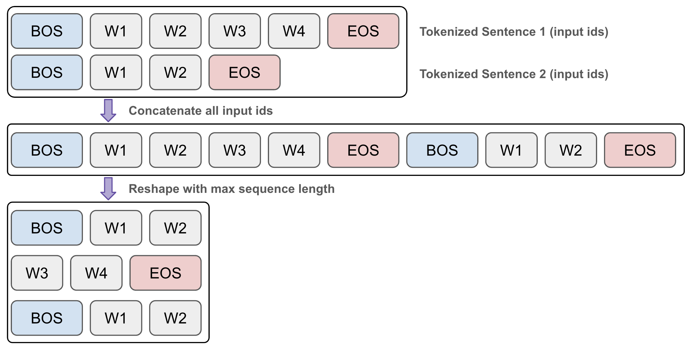
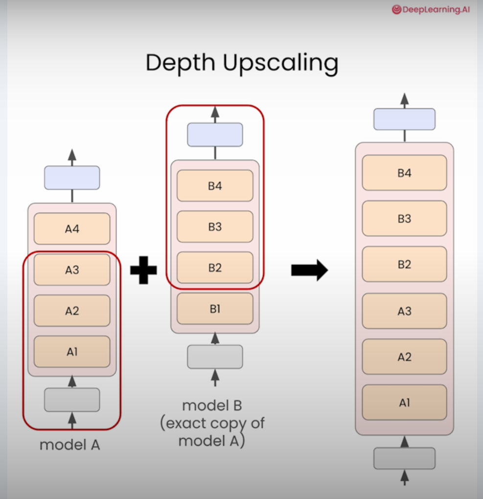
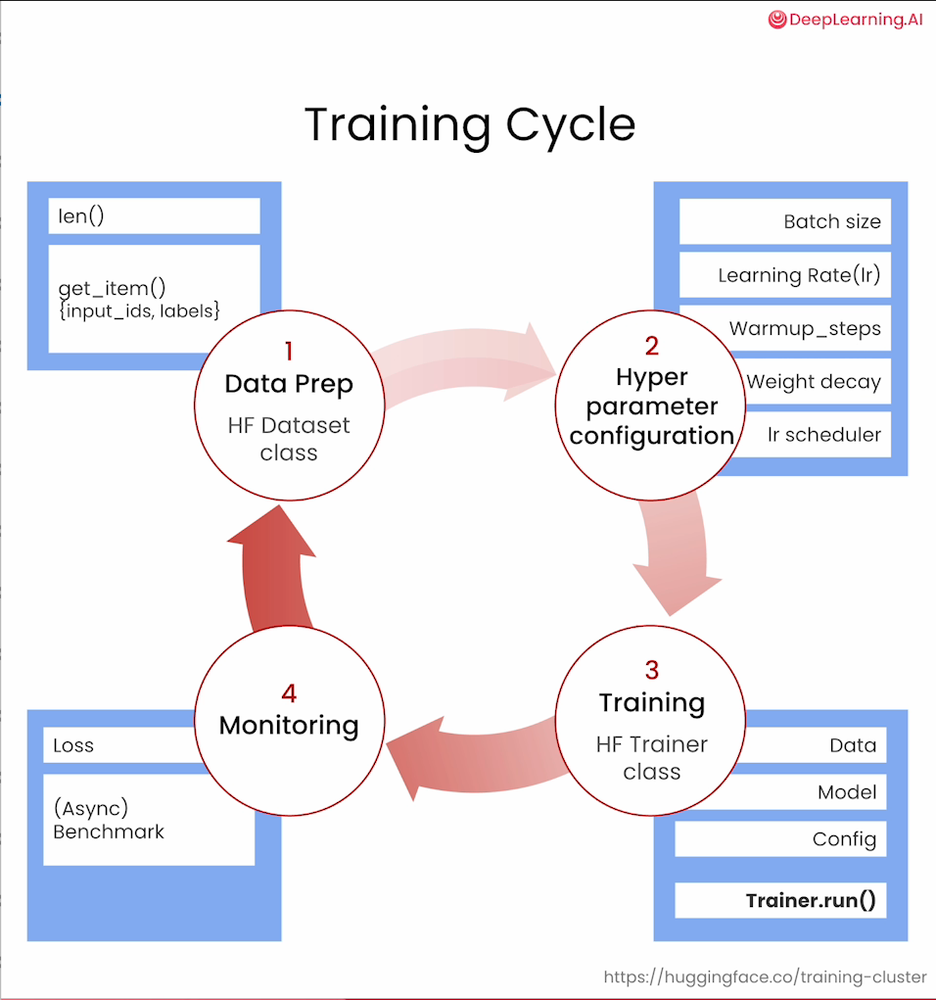
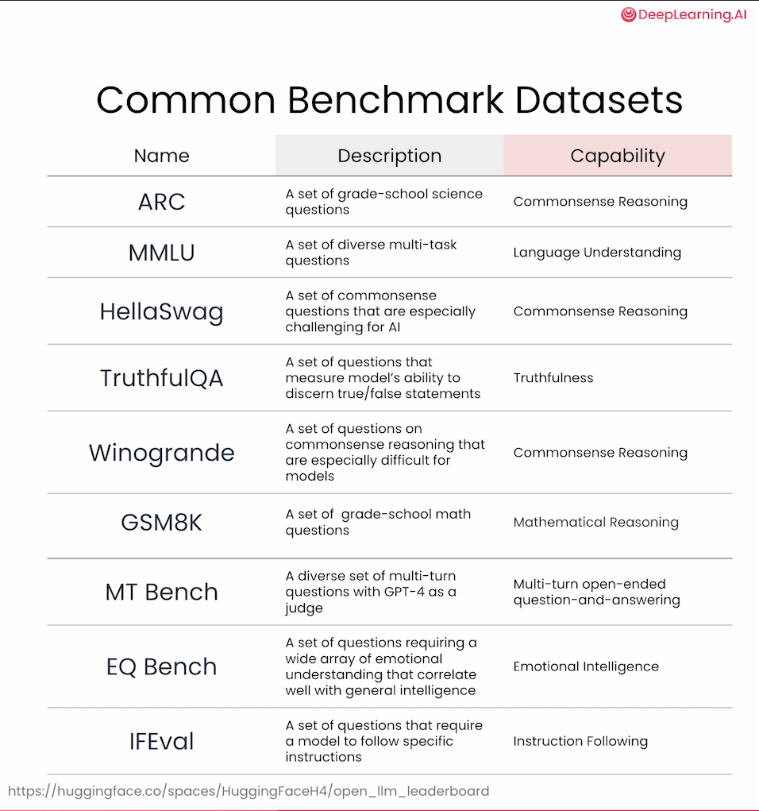

## Overview:
- This directory has my notebooks & concepts on how to perform Continual Pre-training of LLMs from https://learn.deeplearning.ai/courses/pretraining-llms. 
    - This focuses on using Huggingface library to perform LLM pre-training tasks. 
    - For direct Pytorch based LLM pre-training/fine-tuning code, please see my repo https://github.com/sb2g/LLMs_VLMs_1/ (`3_pytorch_from_scratch_llm_code` & `2_pytorch_from_scratch_notebooks`)

## Items covered here:
1. Why continual pre-training helps example.
2. Performing data cleanup on pre-training dataset (on subset of RedPajama)
3. Preparing dataset for pre-training
4. Defining & initializing model (Increase size using Depth upscaling)
5. Training the model (i.e. Pre-training)
6. Standard evaluation methods

## Important images:
- Data Cleanup   
    
- Data Quality      
    
- Data Packing   
    
- Model Depth Upscaling   
    
- Model Training loop   
    
- LLM benchmarks   
    

## Reference:
1. https://learn.deeplearning.ai/courses/pretraining-llms/