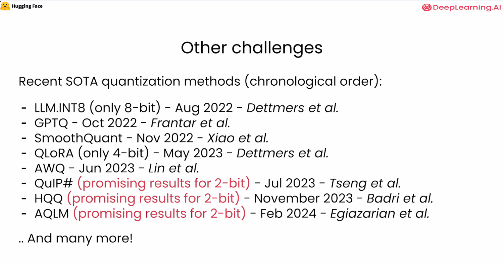

# Images
- Advantages
    -    
    -    

- Data types
    -    
    -    
    - 
    -    

- Linear Quantization
    -    
    -    
    -    
    -    
    -    
    -    
    -    
    -    
    -    
    -    
    -    

- Different granularities
    -    
    -    
    -    

- LLM/SoTA/Challenges
    -    
    -     
    -    
    -    
    -    
    -  
    -  
    -    
    -    
    -   
    -    
    -    
    -    
    -    
    -    
    -    
    -    